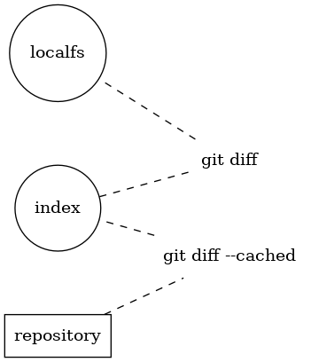

# Yet Another git Guide for svn Users

## Table of Contents
   * [Table of Contents](#table-of-contents)
      * [Why (An Intro)?](#why-an-intro)
   * [TODO](#todo)
      * [Squashing Commits - An Example](#squashing-commits---an-example)
      * [What's Not Here](#whats-not-here)
   * [Other Resources](#other-resources)
      * [Learning Git](#learning-git)
      * [Tools and Setup](#tools-and-setup)
      * [Special Thanks](#special-thanks)
      * [TODOs](#todos)
         * [Once back at work](#once-back-at-work)

## Why (An Intro)?
Thanks to the COVID-19 pandemic, I'm stuck at home. My work team is migrating from `svn` to `git` and I was going to put together a brown bag or two for them, but since I'm doing it from home I'm able to put a copy on GitHub.

There are many sites out there that cover similar things, but many seem to be "how to migrate a repo" or simple [cheat sheets](https://www.git-tower.com/blog/git-for-subversion-users-cheat-sheet/). I want a simple set of things I can present over a lunch session or two.

## Terminology
We know every technical thing has to have its own jargon and lingo, and there is some overlap between the two. I'd like to make sure we're always on the same page. Here a few key terms that we've been using already with svn and how they apply:
| Term         | `svn`                                                                    | `git`                                                                                                                            |
|--------------|--------------------------------------------------------------------------|----------------------------------------------------------------------------------------------------------------------------------|
| working copy | your local checkout                                                      | N/A, but kinda the same                                                                                                          |
| repository   | the One True Copy(TM)                                                    | a _copy_ of the codebase; some people (incorrectly) say "_the repository_" to indicate a central copy, _e.g._ the repo on GitHub |
| revision     | snapshot of the state of all files across all branches                   | snapshot of the file tree at any specific time                                                                                   |
| branch       | another full copy of entire file tree                                    | a pointer into a revision                                                                                                        |
| commit       | save your changes into a new revision for _everybody_ to immediately see | save your changes into a new revision _in your local repository_                                                                 |
| index        | N/A                                                                      | the "staging area" between your local file system (working copy-ish) and the repository                                          |

## What is "The Index?"
Many of us learn better with example, so let's provide an example. This is my file tree:
```
LICENSE
README.md
```
I don't have them in a git repository yet, so I will create one. Details omitted, because it's easy to search and not relevant here. Since the files are new to the repository, I need to `git add` them. What actually happens when I do that?
 * `git` beings to create a new revision, called _the index_, and adds the contents of `LICENSE` and `README.md` to it _immediately_.

Why did I emphasise the word _immediately_? Because `svn add` says "from now on, I need to start watching `LICENSE` and `README.md`", while `git add` _stages_ the contents of the files _as it is right now_ in the index. If I then do `echo FOO >> README.md`, a commit in `svn` would have "FOO" added to the end of the file. In `git`, the `add` adds a snapshot of the file _now_. I'll try to illustrate it a little:


After that set of commands, the index has the original file, while the file system has the new "FOO" at the end:
```
$ git diff
diff --git a/README.md b/README.md
index 1a29b06..24b5c0a 100644
--- a/README.md
+++ b/README.md
<extra info removed>
+FOO
```
And if we want to see "how much" has changed (compared to what would be committed):
```
$ git diff --stat
 README.md | 1 +
 1 file changed, 1 insertion(+)
```
Again, **the default of `git diff` tells you the difference between the file system and the index**. This is important, because `git commit` and `svn commit` are very similar, but act differently.

The subversion mindset is "but these **files** changed, I want them checked in." The git mindset is "only check in the **changes** I explicitly tell you to."

This is further illustrated here, along with the `git diff` variation you need to use to see what is _about to be committed_:



**This is a major source of confusion for subversion users and it's extremely important in unlocking some of the power of git!**

So many times, you'll see the advice to "just run `git add --all` (or `git commit -a`) to add it all." This is using a halberd when you want a scalpel, but it's the default mindset of a svn user, because that's the only tool they had.

### An Index Usage Example
I've been working for a few hours on a small feature, and I didn't have it in a branch (so I'm working in `master`). My local working copy has about six files changed, but mostly added debug statements and other stuff that I don't want checked in. My coworker asks me to tweak a file with some secret sauce that only I know about and nobody else.

#### How To Fix in Subversion
You probably already have two or three working copies from the same repo, right? So you switch to one of the others, do an `svn update` (more on that later), make the change, and then `svn commit`.

#### How to Fix in git (Solution 1)
You fix the two magic files that needed to be fixed. You run `git add -p` which is a special mode of adding that will ask you _each **p**atch_ if it should be added to the index. You know certain files don't need to ask, so you can either tell it not to ask any more about that file ("`d`"") or just give it the two files on the command line, `git add -p file1 file2`. If you had no unrelated changes in the files, you could've skipped the `-p` but we're going to say you had debug enabled at the top of the file, and you don't want that committed. When you're done:
* `git diff --cached` shows you _only_ the changes needed to fix your coworker's problem
* `git commit` will commit _only_ those changes, with all your other files still modified

Hopefully this has shown you some of the power of the index. But what if somebody made changes on the central repo, and you haven't been keeping up to date? Then your `push` might fail. 

## The Stash
#### How to Fix in git (Solution 2)
Another useful tool in the git toolbox is _The Stash_. It is a place where you can stash changes temporarily for various reasons. In this example, it's because you need to make changes but didn't get the latest "official" code (see below for more).
```
$ git stash save "need to fix something"
Saved working directory and index state On master: need to fix something
$ git stash list
stash@{0}: On master: need to fix something
stash@{1}: WIP on master: 2ca9eec diffs image
```
The stash can be thought of as a special branch that stores changesets that are _only available to the local repository_. That means they won't ever leave that working copy. So we've saved off our work (all that ghetto debugging with `printf` etc.) and now have a clean version of `master` again!
```
$ git pull
# code code code and fix the problem
$ git diff
$ git commit -am "Fixed the doohickey again"  # git commit -a is NOT RECOMMENDED
$ git push
$ git stash pop
On branch master
Changes not staged for commit:
  (use "git add <file>..." to update what will be committed)
  (use "git checkout -- <file>..." to discard changes in working directory)

        modified:   README.md

no changes added to commit (use "git add" and/or "git commit -a")
Dropped refs/stash@{0} (ed5e73f01a6c0de518cdc24a9cf2da4dd7a6fff5)
```

### Another Stash Usage Example
See there that `stash@{0}` is a revision? It _was_ `ed5e73f01a6c0de518cdc24a9cf2da4dd7a6fff5`, but now it's gone. Since a revision is _roughly_ a changeset, you can actually `apply` it instead and it will stay in there. So you could actually do something like this:
```
# write code to enable debug mode in a submodule
$ git stash save "Enable debug mode in submodule X"
```
What would this do? Three weeks from now, you can be working in submodule X. You already have a snippet that enables all the debugging that you can apply automatically at any time!
```
$ git stash list
# find the one you want, let's say it's stash@{3}
$ git stash apply stash@{3}
# your working copy now has debug enabled on submodule X!
```

## Committing Your Changes - add, fetch, pull, push, etc.
This is another sticky point for svn users, so let's talk about what happens when. As a reminder:


`origin` is the default name for an upstream repository; the "main" copy hosted on a corporate server or GitHub, etc. It's where you originally "cloned" from above.

Earlier we talked about `git add` and how to put your changes into the index. If you then `git commit` them, they are put into _your_ repository. In subversion, it's _everybody's_ repository, so you know you were always working with the latest code (because you were forced to `svn update` before you could commit if you weren't!).

Terminology:
| Command   | Usage                                                                          |
|-----------|--------------------------------------------------------------------------------|
| `add`     | adds a file to the index to be _committed_                                     |
| `commit`  | writes a set of changes into the repository as a _revision_                    |
| `fetch`   | synchronizes the database from a remote repository _to_ the local (read-only)  |
| `merge`   | merges two _revisions_ into a single _revision_ (not _always_ a branch!)       |
| `pull`    | combines fetch and merge into a single command                                 |
| `push`    | synchronizes the database from a local repository _to_ the remote (write-only) |

_This assumes you set `autosetuprebase` as noted in the Setup section._

`git pull` is _roughly_ equivalent to `svn update` and is the command you will likely use the most. However, for completeness, let's examine the two underlying commands because they can be useful in their own:

### git fetch
This will read all the changes from a remote repository (by default `origin`) and replicate them in the local repository. These revisions are _now all available_ immediately in our repository. _However_ they are _not_ expressed in our local filesystem. If I was working yesterday on a branch named `branchA`, and I pushed it to the server, the one revision `24f3b8fecf` in my repository is _referenced_ as my branch `branchA` and also `origin/branchA`. However, if my coworker made some changes this morning and pushed them, I just received them in my repostory. `branchA` on _my_ repository has not changed, but `origin/branchA` is now `fcbd2855f`.

### git merge
This command is usually used for another reason (which we'll touch on, but as an svn user, you already know). But, as noted above, `git merge` will merges two _revision_ into a single _revision_ and we want to merge "our" `branchA` (`24f3b8fecf`) with "their" `branchA` (`origin/branchA` or `fcbd2855f`). So to do that (assuming the local branch is already in `branchA`), we use the same merge command but the "target" of the merge looks special:
```
$ git merge origin/branchA
```

### git pull
So that leaves us with `git pull`. It's basically a shortcut - it is equivalent to `git fetch && git merge origin/<branchname>`. It is what you will do 99% of the time, and can be treated as a rough equivalent of `svn update`. The difference is that if the merge fails, the fetch did happen, so you can locally examine what is wrong, _e.g._:
```
$ git diff 

# LEFT OFF HERE...
merge
pull
push

Why? Now, to show you some of the power of the index.
 - example with bouncing between commits for different reasons
 - expand to branches
 - show add -p

## Squashing Commits - An Example
Squashing commits is a useful way to keep related changes within a single changeset for later examination. There are good arguments both _for_ squashing ("no need to see how the sausage was made and these intermediate changesets that make no sense on their own") and _against_ ("the way this document was tweaked is unique enough that I might want to reference that specific changeset later"). 

The following is an example of merging in a branch "`feature--cool-intro`" from the top-level of the repository:
* `git checkout master`

Ensure latest sync with server:
* `git pull --rebase`
* `git merge --no-commit --squash feature--cool-intro`

At this point, the merge is staged in the "index,"" but the git-proposed commit message is not very human-readable (it includes the full logs of all intermediate commits). This information is stored in your repository in `.git/SQUASH_MSG`:
```
$ grep commit .git/SQUASH_MSG | tail -3
commit 5faf49f11536fbae7819c559a62a21a47ec505c3
commit 0cd5cd8ae470377ed11b22058a45a895e318d4fa
commit 1b4f298de3ae062063c02b767f045aa3ecf3be82
```
Note the last commit ID, in this example `1b4f298de3ae062063c02b767f045aa3ecf3be82`, which is the first change in the branch when it first came out of "`master`" (or when it was last pushed there).

Now we will create a new proposed log message in a prettier format and condensed information:
 * `git log --format=’%h (%cD)%+s%+b’ --graph 1b4f298de3ae062063c02b767f045aa3ecf3be82^..feature--cool-intro > /tmp/commit_message`

Don’t miss the "^" which indicates that the log should begin at the changeset _before_ the requested, which makes it include that changeset as well.
* `git commit -eF /tmp/commit message`

This will launch your editor. If your editor is git-savvy, it will note that your current commit format is invalid. Be sure to insert two lines into the beginning:
1. Your one-line commit summary, used to generate log messages like the one currently being edited. It should probably be something like "Squashed commit of feature--cool-intro".
2. A totally blank line.

## What's Not Here
There are some other things I've already documented on an internal wiki for my team that may interest public users; treat this as a breadcrumb that you might want to search the internet for more information:
* Using `git bisect` to automate finding where something is broken
* Using `git bundle` when traveling and needing a minimal set of files with you

# Other Resources
## Learning Git
I started learning git back in 2015, and I noted that the following sites were great help, and I highly recommend them still:
 * A [one-hour preview talk](https://www.youtube.com/watch?v=8dhZ9BXQgc4) from 2007 by Randal Schwartz (of perl fame)
   * Great intro, including around 3:20 when he simply asks "What is git?" and notes it tracks **"Changes to a tree of files over time"**
  * Ignore what he says about `git rebase` - in my experience, it's rarely used
* [The Thing About Git](https://tomayko.com/blog/2008/the-thing-about-git) by Rtan Tomayko was a good intro to the usage side
* [Think Like (a) Git](http://think-like-a-git.net/) by Sam Livingston-Gray was an **excellent** site that I used that really helped me understand the (graph) theory, the way it all comes together
* [Git Immersion](http://gitimmersion.com/index.html) by Neo Innovation is a **great** hands-on lab-like approach to learning

## Tools and Setup
In my previous office, we had "free reign" so I was able to use any tools I wanted. In a perfect world, I'd still have access to them all:
 * `git dag` - from [git-cola](https://git-cola.github.io/) (also has a nice diff viewer)
 * `git lg` - an alias I use daily - possibly [from here](https://coderwall.com/p/euwpig/a-better-git-log) and old notes of mine are below
 * Bash prompt support
   * Found in various locations but part of git's "contributed" - see [this git page](https://git-scm.com/book/id/v2/Appendix-A%3A-Git-in-Other-Environments-Git-in-Bash) for more
   * Source is [here](https://github.com/git/git/blob/master/contrib/completion/git-prompt.sh)
   * For CentOS7, it was at `/usr/share/git-core/contrib/completion/git-prompt.sh` after installing (???)
   * Add the following to your `~/.bashrc` file to get immediate feedback from the shell concerning the status of your working copy:
```
if [ -e /usr/share/git-core/contrib/completion/git-prompt.sh ]; then
  . /usr/share/git-core/contrib/completion/git-prompt.sh
  export GIT_PS1_SHOWDIRTYSTATE=1
  export GIT_PS1_SHOWCOLORHINTS=1
  export GIT_PS1_SHOWUPSTREAM="auto"
  PROMPT_COMMAND='history -a;__git_ps1 "\u@\h:\w" "\\\$ "'
fi
```
* Some settings to add to your `~/.gitconfig` for some nice aliases:
```
[branch]
    autosetuprebase = always
[alias]
    last = log -1 HEAD
    g = grep --break --heading --line-number -i
    lg = log --graph --pretty=format:'%Cred%h%Creset -%C(yellow)%d%Creset %s %Cgreen(%cr) %C(bold blue)<%an>%Creset' --abbrev-commit --date=relative --full-history --simplify-merges
```
* `meld` as your merge resolver (when conflicts occur, running `git mergetool` will launch)
```
$ git config --global diff.tool meld
$ git config --global merge.tool meld
```

## Special Thanks
 * [Dillinger](https://dillinger.io/) an online Markdown editor
 * [Tables Generator](https://www.tablesgenerator.com/markdown_tables) for online table generation
 * [WebGraphviz](http://www.webgraphviz.com/) for online Graphviz graphics
 * [gh-md-toc](https://github.com/ekalinin/github-markdown-toc) for the (offline) generation of the Table of Contents

# TODOs
 * Anywhere
* Speculative / trial branches super light weight
* `git add -p`
* `git grep`
* The Index
* repo vs repo vs repo vs remotes
* Squashing and FF
 ### Once back at work
* Name of other prompt program
* update vs fetch vs pull

